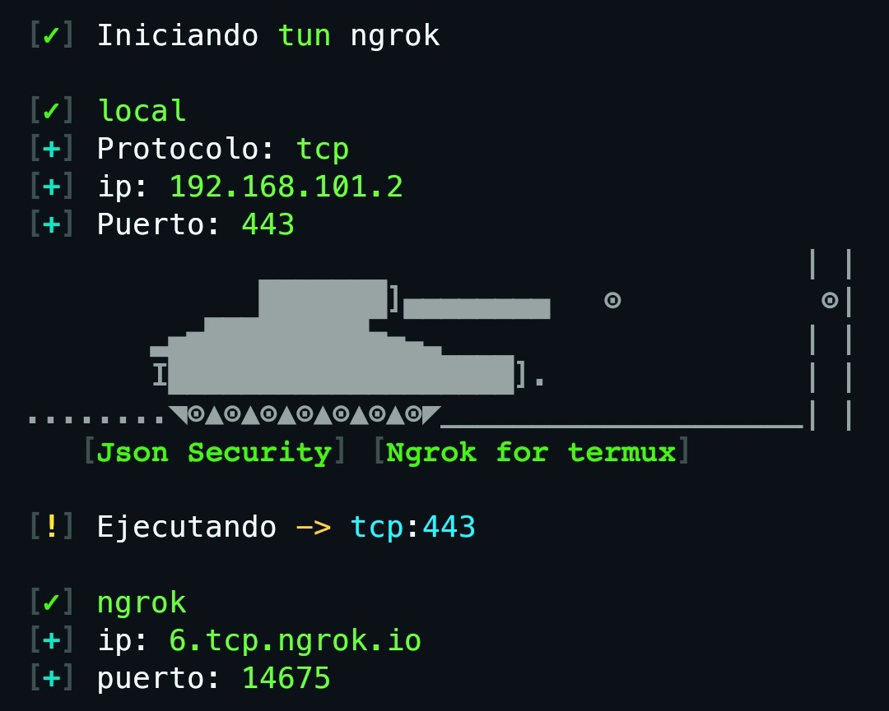

# tunNgrok
This repository serves to automate The installation of NGROK in Termux - 2024

<h3>PLATFORMS</h3>
- Termux

<h3>INSTALATION</h3>
<pre>
git clone https://github.com/JsonSecurity/tunNgrok

cd tunNgrok
chmod +x install.sh
chmod +x ngrok.sh

./install.sh
</pre>

Restart your terminal

<h3>Help</h3>
<pre>
tun
</pre>

[ ! ] Script tun ngrok 3.2 by [ Json Security ]
 
   [+] Execution:
	    tun -e
				
   [+] Config:
	    tun -s \<protocolo\> -p \<puerto\>
			

<h3>Tunel TCP</h3>

<pre>
tun -s tcp -p 443
</pre>

<h3>Tunel HTTP</h3>

<pre>
tun -s http -p 8080
</pre>

